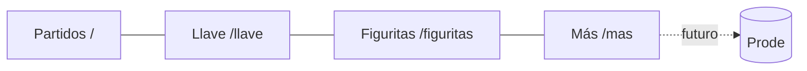

# Arquitectura

## Principios

- **Local-first**: en la v1 no hay backend. El estado del usuario vive en `localStorage`.
- **Lógica pura y testeada**: las reglas del torneo son funciones sin React, en `src/lib`.
- **Capas claras** y dependencias en una sola dirección.
- **Mobile-first, estático y rápido**: páginas SSG, hidratación liviana, PWA offline.

## Capas y flujo de datos

```
┌────────────┐   ┌──────────┐   ┌────────────┐   ┌───────────────────────┐
│  src/data  │ → │ src/lib  │ → │ src/store  │ → │ features / components │
│ (datasets) │   │ (lógica) │   │ (estado)   │   │ (UI, React)           │
└────────────┘   └──────────┘   └────────────┘   └───────────────────────┘
        ▲              ▲
        └── src/types ─┘  (modelo de dominio compartido)
```

- **`src/types`**: modelo de dominio (equipos, grupos, partidos, cupos de llave, figuritas).
- **`src/data`**: datasets curados + `validate.ts` (integridad con Zod). No dependen de React.
- **`src/lib`**: funciones puras:
  - `standings.ts`: tabla de grupo + desempates de FIFA.
  - `bracket.ts`: ranking de terceros, asignación a Dieciseisavos y progresión de la llave.
  - `dates.ts`: formato en hora de Argentina.
  - `ics.ts`: exportación a calendario.
- **`src/store`**: Zustand + `persist` (localStorage). Tres stores: `simulation`, `stickers`,
  `preferences`. `skipHydration: true` para ser SSR-safe (rehidratación manual en `Providers`).
- **`src/features`** y **`src/components`**: la UI. Las páginas (`src/app/**/page.tsx`) son finas y
  delegan en `features/.../*View.tsx`.

> Regla: la UI **lee** del store y **llama** a `lib`. La lógica nunca vive en componentes.

## Render y estado

- App Router con páginas **estáticas** (SSG). Las vistas interactivas son client components
  (`'use client'`).
- Para evitar desajustes de hidratación con datos persistidos, los stores usan `skipHydration` y se
  rehidratan en `components/Providers.tsx` tras el montaje. El primer render (servidor y cliente)
  usa el estado por defecto y luego se actualiza con lo guardado.
- El tema se aplica antes de pintar con un pequeño script inline en `layout.tsx` (evita el “flash”),
  y se mantiene sincronizado desde `Providers`.

## Cálculo de la llave (resumen)

1. `computeGroupStandings` arma cada tabla y asigna posiciones con desempates.
2. Se rankean los 12 terceros; si los 12 grupos están completos, clasifican los **8 mejores**.
3. `allocateThirds` asigna cada tercero a su cupo de Dieciseisavos evitando revancha de grupo
   (backtracking determinístico; siempre existe solución).
4. `resolveKnockout` resuelve cada cruce: 1.º/2.º de grupo, mejores terceros, y
   ganadores/perdedores de partidos previos (procesa en orden de número).

Detalle y tests en [TESTING.md](TESTING.md) y `src/lib/bracket.test.ts`.

## PWA / offline

- `public/manifest.webmanifest` + iconos SVG (`icon.svg`, `icon-maskable.svg`).
- `public/sw.js`: service worker propio (sin plugin de build). Navegaciones _network-first_ con
  fallback a la ruta cacheada o a `offline.html`; assets con _stale-while-revalidate_.
- Se registra solo en producción desde `Providers`.

## Evolución a Prode (Fase 6)

El estado local (`simulation`, `stickers`) ya tiene un shape mapeable a tablas de Supabase. Cuando
se implemente el Prode se agrega una capa de sincronización sin reescribir la lógica. Ver
[FEATURES/04-prode-futuro.md](FEATURES/04-prode-futuro.md) y
[DECISIONS/0003-supabase-prode.md](DECISIONS/0003-supabase-prode.md).

## Diagrama de navegación


